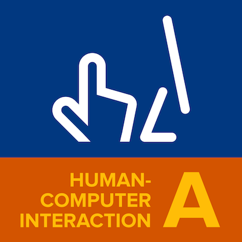

# IF184601 - Human-Computer Interaction (A)

## About
#### Schedule
Thursday, 10.00 – 12.50
#### Classroom
IF-LP2
#### Lecturer
Hadziq Fabroyir 
- **NPP**: 1986201911089 )
- **Email**:
hadziq (at) if.its.ac.id
- **Office**:
IF-233 ( 2nd Floor, North Corridor )
- **Office hours**:
Tuesday and Friday, 09.00 – 11.00 ( or by appointment )

## Grading

1. Presence: 10%
2. Assignments: 30%
3. Individual midterm: 30%
4. Grouped final project: 30%
5. Extra scores for any engagement during the course: questioning, answering, commenting, etc.

## Reading References

1. **The UX Book** by Rex Hartson and Pardha Pyla
2. **Human-Computer Interaction** by Alan Dix
3. **The Design of Everyday Things** by Don Norman
